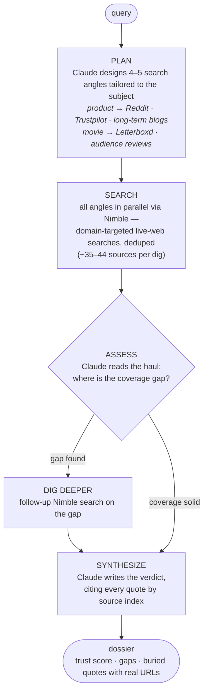
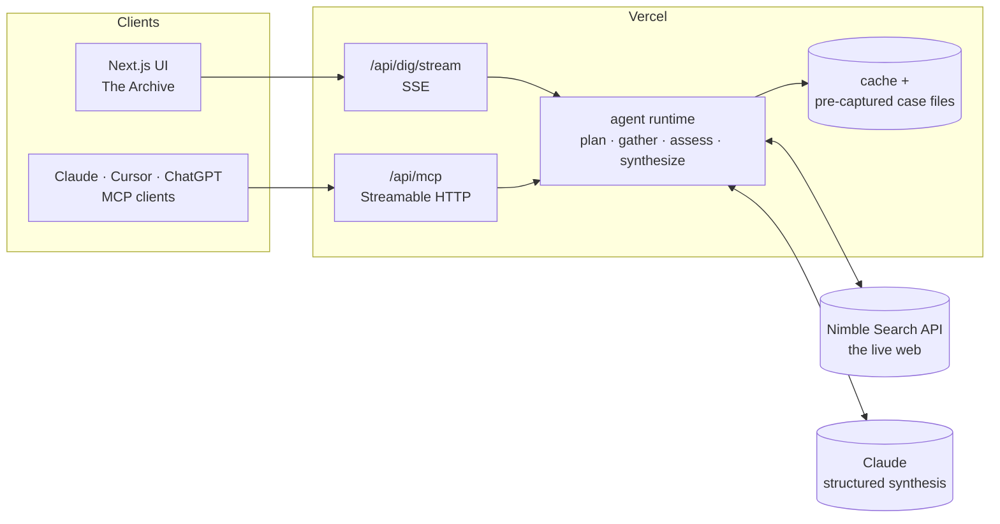

# hidden.reviews

**Reviews are usually hidden. Not here.**

The top of every search result is polished, SEO-optimised marketing. The honest takes — the ones real people leave on Reddit, Trustpilot, niche forums, and long-form blogs — are buried pages deep, and asking an AI chatbot just summarises the same shiny surface. **hidden.reviews** is an AI research agent that digs them out: it sees the live web, reads the candid sources, and files an honest, fully-sourced verdict before you buy, book, or watch.

🔗 **Live:** https://hidden-reviews.vercel.app · 🔌 **MCP server:** `https://hidden-reviews.vercel.app/api/mcp`

## What you get

Search any product, place, company, restaurant, or movie. The agent files a **dossier**:

- an **honest verdict** + a 0–100 **trust score** — readable at a glance
- **what the marketing doesn't tell you**, with per-claim source counts
- **marketing vs. reality** sentiment gaps
- **buried testimony** — candid quotes, each linked to its real source URL
- the **investigation log** — every search the agent ran, streamed live as it works

Every investigation becomes a case in **The Archive** and lives at a shareable `/<slug>` URL.

## How the agent works

Not one API call — a plan → search → assess → re-search → synthesize loop:



Every step streams to the UI over Server-Sent Events — you watch the real Nimble queries fire as it digs.

## Architecture



## Honest by construction

- **No hallucinated sources.** Claude cites sources only by index; the real URL is rebuilt in code from the Nimble result (`src/lib/agent/run.ts`). The model physically cannot invent a link.
- **Untrusted input stays untrusted.** Only `http(s)` URLs enter the pipeline, quotes render as escaped text, and the synthesis prompt treats page content as data, never as instructions.
- **Live vs. filed is labelled.** Live digs carry a `Live · Nimble` badge; showcase cases are pre-captured *real* digs (genuine results, saved so the most-clicked queries return instantly).
- **Degrades, never 500s.** If synthesis runs long, the agent returns the raw buried sources it already pulled.
- **Credit-safe.** Live digs are rate-limited per IP; cached and filed cases are always free and instant.

## Nimble as a toolbox, not a single call

The engine is built on the **Nimble Search API** (`/v1/search`):

- **Multi-angle search + a feedback loop** — 4–5 model-planned queries, then an assess step that names the coverage gap and fires a follow-up (~6 searches per dig)
- **Domain targeting** — `include_domains` to hit Reddit, Trustpilot, Letterboxd, Yelp specifically
- **Adaptive depth** — `search_depth: lite` drives the real-time path; `deep` full-page extraction is supported in the client
- **Parallel + resilient** — `Promise.allSettled`, per-search timeouts; one failing angle never sinks the dig

## Use it from your AI (MCP)

hidden.reviews is a remote **MCP server** — add one URL and your assistant can pull the honest reviews it's otherwise blind to:

```json
{
  "mcpServers": {
    "hidden-reviews": { "url": "https://hidden-reviews.vercel.app/api/mcp" }
  }
}
```

Tool: `get_hidden_reviews(query)` → the sourced verdict, formatted for an LLM.

## Stack

- **Next.js 16** (App Router, Turbopack) · TypeScript · Tailwind v4 · Motion
- **Nimble Search API** — live-web intelligence
- **Claude** — planning, the assess loop, and structured synthesis (`messages.parse` + Zod)
- **mcp-handler** — Streamable HTTP MCP server
- Deployed on **Vercel**

## Project layout

```
src/lib/agent/plan.ts      Claude plans the search angles (adaptive per subject)
src/lib/agent/gather.ts    runs the searches in parallel, dedupes by URL
src/lib/agent/assess.ts    the feedback loop: finds the coverage gap, re-searches
src/lib/agent/run.ts       orchestrates plan → search → assess → synth, emits the trace
src/lib/nimble/client.ts   configurable Nimble Search client
src/lib/synth/claude.ts    structured, index-grounded synthesis
src/lib/rate-limit.ts      per-IP guard for cost-bearing live digs
src/lib/dig/               cache → seed → mock → live resolution + SSE client
src/app/api/dig/stream     Server-Sent Events endpoint (the live trace)
src/app/api/mcp            remote MCP server
src/components/            the Archive, dossiers, redaction reveals
```

## Run locally

```bash
npm install
cp .env.example .env.local   # add NIMBLE_API_KEY + ANTHROPIC_API_KEY
npm run dev
```

Without keys it runs in **demo mode** (canned data) so the UI is fully explorable offline.
